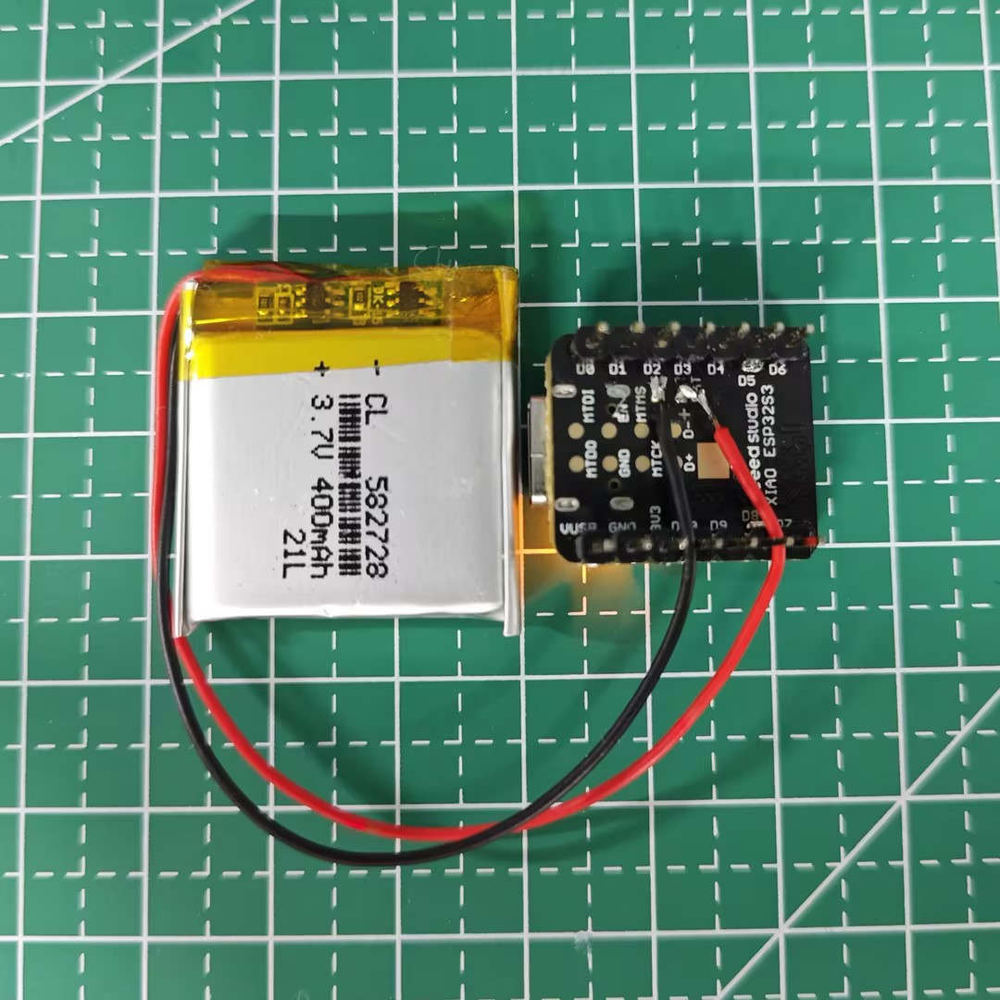

# <span ><span style='vertical-align: middle; line-height: normal;'>&nbsp;Starmoon - An affordable, empathic, and conversational AI companion</span></span>

Starmoon is an affordable, compact AI-enabled device, you can take anywhere and converse with. It can understand your emotions and respond with empathy, offering supportive conversations and personalized learning assistance.


[Check our Roadmap](roadmap.md)

<!-- Put on a toy, Hanging on the hand, put on the desktop near macbook -->

<div align="center">
    

[](https://discord.gg/KJWxDPBRUj)


[](https://www.gnu.org/licenses/gpl-3.0.en.html)&ensp;&ensp;&ensp;


</div>

## Demo Highlights 🎥

https://github.com/user-attachments/assets/89394491-9d87-48ab-b2df-90028118450b

If you can't see the video, you can watch it [here](https://www.youtube.com/watch?v=59rwFuCMviE)

## Key features 🎯

-   **Cost-effective**: Assemble the device yourself with affordable off-the-shelf components.
-   **Voice-enabled emotional intelligence**: Understand and analyze insights in your emotions through your conversations in real time.
-   **Open-source**: Fully open-source, you can deploy Starmoon locally and self-host to ensure the privacy of your data.
-   **Compact device**: Only slightly larger than an Apple Watch, you can carry the device anywhere.
-   **Reduced screen time**: A myriad of AI companions are screen-based, and our intention is to give your eyes a rest.

## Getting Started 🚀

### Prerequisites 📋

1. Software:
    - Vscode and [PlatformIO](https://platformio.org/install/ide?install=vscode) plugin: For firmware burning
    - Starmoon API key: Login to [Starmoon](https://www.starmoon.app/login) and go to settings page to get your API key

2. Hardware list (Tax and shipping rates may vary by region)
    - [Seeed Studio Xiao ESP32S3](https://www.aliexpress.us/item/1005007341749305.html)
    - [Microphone (INMP441)](https://www.aliexpress.us/item/3256806674485209.html)
    - [Amplifier (MAX98357A)](https://www.aliexpress.us/item/3256806524695775.html)
    - [Speaker (3525)](https://www.aliexpress.us/item/3256805515112434.html)
    - [LED light](https://www.aliexpress.us/item/3256805384408000.html)
    - [Button](https://www.aliexpress.us/item/3256803815119722.html)
    - [PCB prototype board](https://www.aliexpress.com/item/1005005038301414.html) or [custom PCB](https://www.aliexpress.com/item/1005005038301414.html)
    - [3D printed case](case_model.stl)
    - Tools: [28AWG wires](https://www.aliexpress.us/item/3256801511896966.html) + [soldering toolset](https://www.aliexpress.com/item/1005007010143403.html) + [flux](https://www.aliexpress.com/item/1005007003481283.html)


### Hardware setup 🧰

-   **Step 0**: Follow the below Pin Configuration to set up the the ESP32 device
<!-- -   Build the device yourself (alternatively, the [Starmoon DIY Dev Kit](https://www.starmoon.app/products) comes pre-assembled so you can focus on working with your own frontend + backend) -->

| **Component**              | **Seeed Studio XIAO ESP32S3** | **ESP32-S3** |
| -------------------------- | ----------------------------- | ------------ |
| **I2S Input (Microphone)** |                               |              |
| SD                         | D0                            | GPIO 13      |
| WS                         | D1                            | GPIO 1       |
| SCK                        | D2                            | GPIO 4       |
| **I2S Output (Speaker)**   |                               |              |
| WS                         | D5                            | GPIO 5       |
| BCK                        | D6                            | GPIO 6       |
| DATA                       | D4                            | GPIO 7       |
| SD (shutdown)              | D3                            | N/A          |
| **Others**                 |                               |              |
| LED Red                    | N/A                           | GPIO 9       |
| LED Green                  | N/A                           | GPIO 8       |
| LED Blue                   | D9                            | GPIO 13      |
| Button                     | D10                           | GPIO 2       |

If you are using the Seeed Studio XIAO ESP32S3, then you can directly connect the lithium battery to the back of the ESP32.


-   **Step 1**: If you use normal ESP32-S3 chip, otherwise you can skip this step:
    - please go to [Config.h](firmware/src/Config.h) and uncomment the `USE_NORMAL_ESP32_S3` line and comment the `USE_XIAO_ESP32_DEVKIT` line.

        ```cpp
        // ----------------- Pin Definitions -----------------
        // Define which board you are using (uncomment one)
        #define USE_NORMAL_ESP32_S3
        // #define USE_XIAO_ESP32_DEVKIT
        // #define USE_XIAO_ESP32
        // #define USE_NORMAL_ESP32
        // #define USE_ESP32_S3_WHITE_CASE
        ```

    - Then, go to [platformio.ini](firmware/platformio.ini) and uncomment the `[env:esp32-s3-devkitm-1]` block and comment the `[env:seeed_xiao_esp32s3]` line.

        ```cpp
        ; [env:seeed_xiao_esp32s3]
        ; platform = espressif32
        ; board = seeed_xiao_esp32s3
        ; framework = arduino
        ; monitor_speed = 115200

        [env:esp32-s3-devkitm-1]
        platform = espressif32
        board = esp32-s3-devkitm-1
        framework = arduino
        monitor_speed = 115200

-   **Step 2**: Click PlatformIO Icon in VScode left sidebar

    -   Click "Pick a folder"
    -   Select the location of the `firmware` folder in the current project.


-   **Step 3**: Build the firmware

    -   Click `Build` button in the PlatformIO toolbar or run the build task.

-   **Step 4**: Upload the firmware to the device
    -   Connect your ESP32-S3 to your computer using usb.
    -   Click the `Upload` button to run the upload task, or `Upload and Monitor` button to run the upload task and monitor the device.
-   **Step 5**: Hardware usage

    -   Turn on the device by main button and wait for the LED to turn on.
    -   Use your phone/tablet/pc to connect "Starmoon-xxx" WiFi and follow the instructions to set up internet connection (only support 2.4Ghz WiFi).
        -   Connect the wifi by your credentials
        -   Use your Starmoon API key and email to set up the device

        <!-- -   The LED indicates the current status:
            -   Off: Not connected
            -   Solid On: Connected and listening on microphone
            -   Pulsing: Streaming audio output (receiving from server) -->

## License

This project is licensed under the GPL-3.0 License - see the [LICENSE](LICENSE) file for details
